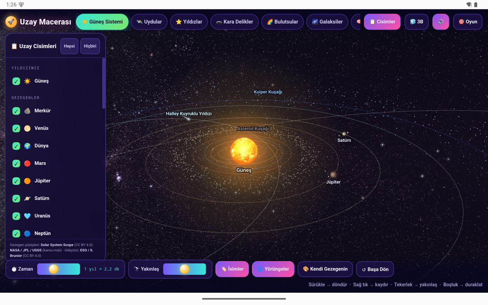
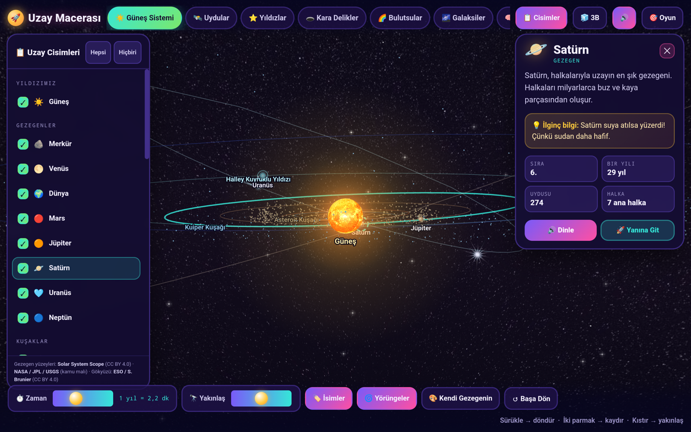

# Genymede — Uzay Macerası

An interactive space simulation for children aged 4–10, in Turkish. **A single HTML file** with no dependencies:
no libraries, no CDN, no internet connection needed. A hand-written 3D perspective engine on Canvas 2D, plus a
colourful 2D cartoon mode for younger children. It also builds as an Android app; iOS and the app stores come next.

The app's user interface is in Turkish, and so are the identifiers and comments in the source code — that is a
deliberate choice for a Turkish children's project. This documentation is in English.



## Try it

Open `uzay-macerasi.html` in a browser. Keep the `dokular/` folder next to it; without it, planet surfaces and the sky
fall back to procedurally generated textures and the app still works.

- Drag → rotate · right-drag (or Shift) → pan · wheel / pinch → zoom · tap → identify · Space → pause
- On touch screens: two-finger drag → pan, pinch → zoom.

## What's inside

- **7 scenes:** Solar System, Moons, Stars, Black Holes, Nebulae, Galaxies, Einstein Lab.
- **63 celestial bodies**, each can be switched on and off; info card with a Turkish description, a fun fact and data tiles.
- **A real black hole:** Schwarzschild geodesics are ray-traced per pixel. The far side of the disc arcs above and below
  the shadow, the photon ring sits on its edge, background stars wrap around it as Einstein rings; the approaching side is
  Doppler-brightened, the receding side reddened. The camera can orbit freely. Rendered on the GPU when WebGL is
  available, otherwise on a multi-core CPU path.
- **A real sky:** in the Solar System the background is a celestial sphere; the ESO Milky Way panorama is wrapped onto it
  and the galactic plane is tilted 60.2° to the ecliptic, as it really is.
- **Real surface maps:** equirectangular NASA / USGS / Solar System Scope maps wrapped onto 19 bodies.
- **Real time ratios:** axial rotation, orbit around the Sun and moon orbits all run at their true periods. Venus and
  Uranus rotate backwards, Triton orbits backwards, Uranus lies on its side so its rings appear vertical.
- **Consistent scale:** sizes come from a single power law, orbits from compressed real perihelion/aphelion values; size
  ordering and orbit crossings (only Neptune–Pluto and Pluto–Eris) match reality exactly.
- **Zoom down to the surface:** every body, from Phobos to the Sun, fills the screen at full zoom.
- **Lighting:** day/night terminator, phases, bright limb, atmospheric glow on planets with atmospheres, ring shadows
  on Saturn and Uranus.
- **Einstein Lab:** spacetime fabric, gravitational lensing, time dilation, E=mc², speed-of-light panels.
- **For kids:** 3D ↔ 2D toggle, spoken narration (for children who cannot read yet), a "Find it!" game,
  "Make Your Own Planet", confetti and sound effects.




## Privacy and safety

The app is designed to be safe to hand to a child:

- **Fully offline.** The code makes no network requests of any kind; there is nothing to fetch and nowhere to send data.
- **No permissions.** The Android app requests **no Android system permissions** — not even `INTERNET`. Backups and cleartext
  traffic are disabled in the manifest.
- **No data collection.** No accounts, no analytics, no ads, no tracking, no storage of personal data.
- **No third-party code at runtime.** The HTML loads no external scripts. The Android shell uses only Capacitor and one
  plugin that calls the phone's own text-to-speech engine.
- **Official builds** will only ever be distributed through this repository's Releases. Any APK obtained elsewhere
  should be treated as untrusted. See [SECURITY.md](SECURITY.md) for how to verify and how to report a problem.

## Android

The `mobil/` folder wraps the same HTML into an Android app with Capacitor. Build instructions are in
[`mobil/README.md`](mobil/README.md). Narration on Android uses the system's native text-to-speech engine, because
Android's WebView has no Web Speech API.

## Folders

```
uzay-macerasi.html   the whole application
dokular/             surface and sky maps (sources and licences: dokular/SOURCES.md)
araclar/             Python scripts that derive the size/distance scale and check the data against reality
mobil/               Android (and later iOS) shell
screenshots/           screenshots
```

## Done so far

- **15 Sep 2026** — Android app: Capacitor shell, landscape full screen, vector icon, native narrator, touch
  refinements (two-finger pan, larger touch targets), touch shortcut for the diagnostics overlay. Tested on a phone.
  Zero-permission manifest.
- **12 Sep 2026** — Fixed blur and stutter while moving around the black hole: the lensing map is always rendered at
  full resolution and is ~2.8× faster thanks to adaptive block refinement; WebGL path and the Shift+D diagnostics overlay.
- **12 Sep 2026** — Real black hole: ray-traced Schwarzschild rendering, photon ring, Doppler colours.
- **23 Aug 2026** — Real sky: the ESO Milky Way panorama on a celestial sphere.
- **Aug 2026** — Real NASA / USGS surface maps for 19 bodies.
- **16 Aug 2026** — Zoom down to the surface, camera tracking, fixes for drawing defects that reappeared with scale.
- **16 Aug 2026** — The scale rebuilt from scratch: sizes, orbits and moon distances from a single law; data checker.
- **14–16 Aug 2026** — Foundations: 7 scenes, 63 bodies, 3D/2D, Einstein Lab, game, planet maker, narration.

## What's next

Open work lives in **[Issues](../../issues)**, grouped by **[Milestones](../../milestones)**:

1. **Mobile polish** — small-screen layout, back button, background handling, on-device measurements.
2. **Content** — label collisions, persistent user-made planets, ring shadow on the planet.
3. **iOS** — build with Xcode.
4. **Stores** — signed releases, privacy policy, kids-app rules, store assets, reproducible builds.

## Contributing

Open an issue to discuss, or pick one up and send a pull request. A few notes:

- The app is a single file with no external dependencies; this is deliberate.
- The code is ES5-style and identifiers are Turkish.
- Size and distance numbers are never edited by hand; they are generated by `araclar/olcek.py` (see `araclar/README.md`).
- Test black-hole changes with WebGL switched off as well (Shift+G toggles it; Shift+D opens the diagnostics overlay).
- Pull requests must not add network access, permissions, analytics or third-party runtime code. See SECURITY.md.

## Licence and credits

Code is MIT licensed (`LICENSE`). Images carry their own licences: NASA / JPL / USGS (public domain),
Solar System Scope (CC BY 4.0), ESO / S. Brunier (CC BY 4.0) — details in `dokular/SOURCES.md`.
