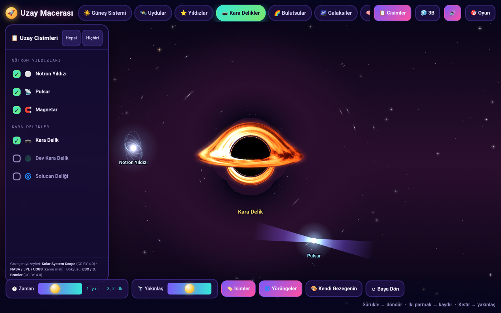
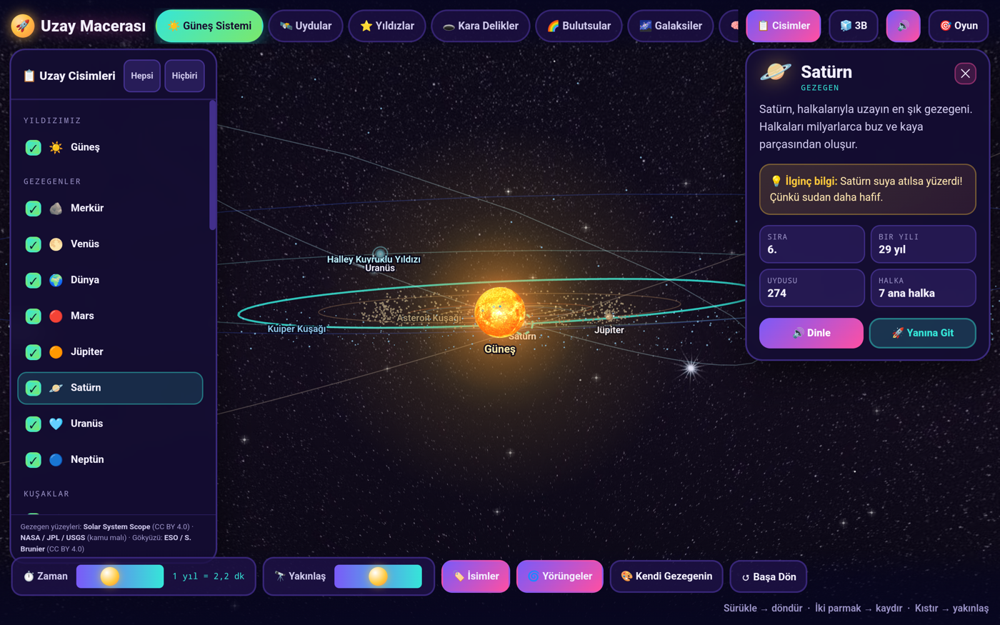

# Genymede — Uzay Macerası

4-10 yaş çocuklar için Türkçe, etkileşimli bir uzay simülasyonu. **Tek HTML dosyası**, dış bağımlılık yok:
kütüphane yok, CDN yok, internet gerekmez. Canvas 2D üzerine elle yazılmış bir 3B perspektif motoru ve
çocuklar için canlı renkli bir 2B çizgi film modu. Android uygulaması olarak da derleniyor; iOS ve mağazalar sırada.


## Denemek için

`uzay-macerasi.html` dosyasını bir tarayıcıda aç. Yanında `dokular/` klasörü dursun; yoksa gezegen yüzeyleri ve gökyüzü
kodla üretilen dokulara döner, uygulama yine çalışır.

- Sürükle → döndür · sağ tık (ya da Shift) sürükle → kaydır · tekerlek / kıstır → yakınlaş · dokun → tanı · Boşluk → duraklat
- Dokunmatikte: iki parmakla kaydır, kıstırarak yakınlaş.

## Neler var

- **7 sahne:** Güneş Sistemi, Uydular, Yıldızlar, Kara Delikler, Bulutsular, Galaksiler, Einstein Laboratuvarı.
- **63 uzay cismi**, her biri tek tek açılıp kapanabilir; Türkçe açıklama, "ilginç bilgi" ve veri kutucuklarıyla bilgi kartı.
- **Gerçek kara delik:** Schwarzschild jeodezikleri piksel piksel izlenir. Diskin arka yarısı gölgenin üstünde ve altında
  kavis olur, kenarda foton halkası, çevrede Einstein halkası gibi sarılan yıldızlar görünür; yaklaşan yan Doppler'le
  parlak, uzaklaşan yan kızıl. Kamera her yönden dolaşabilir. WebGL varsa GPU'da, yoksa çok çekirdekli işlemci yolunda çizilir.
- **Gerçek gökyüzü:** Güneş Sistemi'nde arka plan bir gök küresidir; ESO Samanyolu panoraması küreye sarılır ve
  galaktik düzlem, gerçekte olduğu gibi, ekliptiğe 60,2° eğik durur.
- **Gerçek yüzey haritaları:** 19 cisim için NASA / USGS / Solar System Scope eş dikdörtgen haritaları küreye sarılır.
- **Gerçek zaman oranları:** eksen dönüşü, Güneş etrafında dolanma ve uyduların dolanması gerçek periyotlarıyla.
  Venüs ve Uranüs ters döner, Triton ters dolanır, Uranüs yan yatmış durur ve halkası bu yüzden dikeydir.
- **Tutarlı ölçek:** boyutlar tek eğriden, yörüngeler gerçek günberi/günötenin sıkıştırılmasından türetilir; büyüklük
  sıralaması ve yörünge kesişmeleri (yalnız Neptün–Plüton ve Plüton–Eris) gerçekle birebir.
- **Yüzeye kadar yakınlaşma:** Phobos'tan Güneş'e her cisim tam yakınlaşmada ekranı doldurur.
- **Işıklandırma:** gece/gündüz sınırı, evreler, aydınlık kenar hattı, atmosferli gezegenlerde kenar parıltısı,
  Satürn ve Uranüs'te halka gölgesi.
- **Einstein Laboratuvarı:** uzay-zaman kumaşı, kütleçekimsel mercek, zaman genleşmesi, E=mc², ışık hızı panelleri.
- **Çocuklar için:** 3B ↔ 2B geçişi, sesli anlatım (okuma bilmeyenler için), "Bul Bakalım" oyunu, "Kendi Gezegenini Yap",
  konfeti ve ses efektleri.





## Android

`mobil/` klasörü, aynı HTML'i Capacitor ile Android uygulamasına sarar. Derleme adımları `mobil/BENIOKU.md` içinde.
Sesli anlatım Android'de sistemin yerel okuyucusunu kullanır (WebView'da Web Speech API yok).

## Klasörler

```
uzay-macerasi.html   uygulamanın tamamı
dokular/             yüzey ve gökyüzü haritaları (kaynak ve lisanslar: dokular/KAYNAKLAR.md)
araclar/             boyut/mesafe ölçeğini üreten ve verileri gerçekle karşılaştıran Python betikleri
mobil/               Android (ve ileride iOS) kabuğu
gorseller/           ekran görüntüleri
```

## Yapılanlar

- **15 Eylül 2026** — Android uygulaması: Capacitor kabuğu, yatay tam ekran, vektör ikon, yerel sesli okuyucu, dokunmatik
  düzenlemeler (iki parmakla kaydırma, iri dokunma hedefleri), tanı penceresinin dokunmatik kısayolu. Telefonda denendi.
- **12 Eylül 2026** — Kara delik hareket ederken bulanıklaşma ve takılma giderildi: harita hep tam çözünürlükte,
  uyarlanabilir blok inceltmeyle ~2,8 kat hızlı; WebGL yolu ve Shift+D tanı penceresi eklendi.
- **12 Eylül 2026** — Gerçek kara delik: ışın izlemeli Schwarzschild görünümü, foton halkası, Doppler renkleri.
- **23 Ağustos 2026** — Gerçek gökyüzü: ESO Samanyolu panoraması gök küresine sarıldı.
- **Ağustos 2026** — 19 cisim için gerçek NASA / USGS yüzey haritaları.
- **16 Ağustos 2026** — Yüzeye kadar yakınlaşma, kamera takibi, ölçekle geri gelen çizim kusurlarının giderilmesi.
- **16 Ağustos 2026** — Ölçek baştan kuruldu: boyut, yörünge ve uydu mesafesi tek yasadan; veri denetleyici yazıldı.
- **14–16 Ağustos 2026** — Uygulamanın temeli: 7 sahne, 63 cisim, 3B/2B, Einstein Lab, oyun, gezegen yapıcı, sesli anlatım.

## Yapılacaklar

Açık işler **[Issues](../../issues)** sayfasında, aşamalara göre **[Milestones](../../milestones)** altında:

1. **Mobil düzenleme** — küçük ekran yerleşimi, geri tuşu, arka plan geçişi, telefonda ölçüm.
2. **İçerik** — etiket çakışmaları, yapımcı gezegenlerinin kalıcılığı, halka gölgesi.
3. **iOS** — Xcode ile derleme.
4. **Mağazalar** — imzalı sürüm, gizlilik politikası, çocuk uygulaması kuralları, görseller.

## Katkı

Issue açıp tartışmak ya da bir issue'yu üstlenip pull request göndermek yeter. Birkaç not:

- Uygulama tek dosyadır ve dış bağımlılık almaz; bu bilinçli bir karar.
- Kod ES5 tarzında, değişken ve fonksiyon adları Türkçedir.
- Boyut ve mesafe sayıları elle değiştirilmez; `araclar/olcek.py` ile üretilir (`araclar/BENIOKU.md`).
- Kara delikle ilgili değişiklikleri WebGL kapalıyken de dene (Shift+G kapatır; tanı penceresi Shift+D).

## Lisans ve kaynaklar

Kod MIT lisanslıdır (`LICENSE`). Görseller kendi lisanslarına tabidir: NASA / JPL / USGS (kamu malı),
Solar System Scope (CC BY 4.0), ESO / S. Brunier (CC BY 4.0) — ayrıntı `dokular/KAYNAKLAR.md`.
